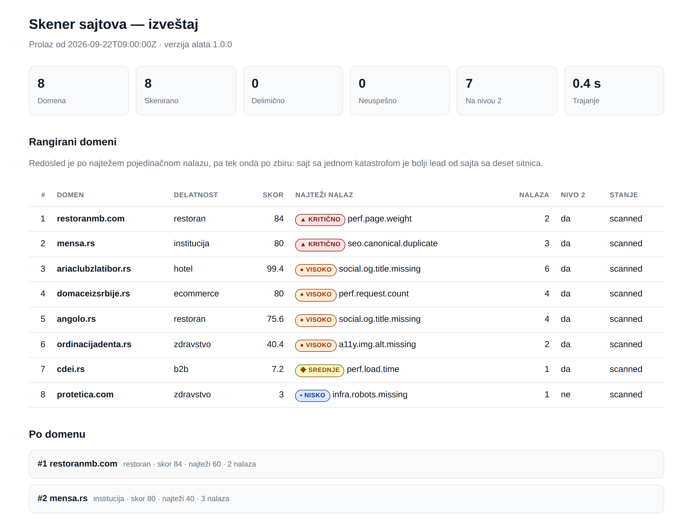

# Skener sajtova

Skener prolazi kroz listu domena, obično stotinak do dvesta, i pravi rangiranu listu sajtova koji
zaslužuju pun ručni audit. Uz svaki sajt ide nekoliko rečenica na srpskom koje se mogu prekopirati u
mejl. Audit ne zamenjuje. Kaže ti gde da potrošiš vreme.



> Izveštaj sa slike je napravljen nad ispitnim skupom iz specifikacije. Ceo HTML je u
> [`docs/primer-izvestaja.html`](docs/primer-izvestaja.html). To je jedan fajl, bez CDN-a, i otvara se
> bez mreže.

## Šta alat namerno ne radi

- Ne skenira portove, ne pokušava prijavu, ne traži ranjivosti i ne popunjava forme.
- Ne ide dublje od početne strane i uzorka iz `sitemap.xml`. Kad mape nema, uzima interne linkove.
- Ne dira nijednu putanju koju `robots.txt` zabranjuje.
- Ne pogađa delatnost sajta. Delatnost je ulazni podatak, ne zaključak.
- Ne popravlja ništa. Alat čita, nikad ne piše.

## Pokretanje

Najlakše je preko Docker-a. U slici je Chromium tačno za verziju Playwright-a iz `pyproject.toml`,
pa se merenje u browseru ponaša isto na svakoj mašini.

```bash
git clone https://github.com/lazicmilos/skener.git
cd skener
mkdir rad
docker compose build
docker compose run --rm skener pytest -q        # svi testovi moraju da prođu
```

Pre prvog skeniranja upiši ko skenira. Administrator svakog sajta u logu servera vidi User-Agent, i iz
njega mora da zna ko ga posećuje i kako da ga kontaktira. Bez toga alat odbija da pošalje i jedan
zahtev. Napravi `rad/moj.toml`:

```toml
[identitet]
naziv = "Web studio Primer"
kontakt = "kontakt@primer.rs"
```

Isto može i preko promenljivih okruženja `SKENER_NAZIV` i `SKENER_KONTAKT`, koje `compose.yaml`
prosleđuje u kontejner. Ime sme da bude i ćirilicom ili sa „š" i „đ". Alat ga za zaglavlje prevodi u
latinicu bez kvačica, jer HTTP zaglavlje prima samo ASCII.

```bash
docker compose run --rm skener skener scan /rad/leads.csv --config /rad/moj.toml --out /rad/izvestaj
```

Na Linux-u pre toga postavi `SKENER_UID=$(id -u)` i `SKENER_GID=$(id -g)`, da izveštaji u `rad/`
pripadaju tebi. Docker Desktop na Windows-u i Mac-u to rešava sam.

Bez Docker-a treba Python 3.11 ili noviji:

```bash
pip install -e '.[browser]'
playwright install chromium
```

## Ulaz i izlaz

Ulaz je CSV sa zaglavljem, ne gola lista domena:

```csv
domain,industry,note
ariaclubzlatibor.rs,hotel,Zlatibor
restoranmb.com,restoran,
protetica.com,zdravstvo,kontrolni čist sajt
```

`industry` je jedno od `hotel`, `restoran`, `zdravstvo`, `ecommerce`, `b2b`, `institucija` i
`ostalo`. Prazno polje i nepoznata vrednost padaju na `ostalo`. Delatnost menja koliko koji nalaz
vredi: slika za deljenje linka je hotelu važna, a b2b sajtu skoro nebitna.

Lista najčešće stiže iz Excel-a, pa alat prihvata i ono što Excel pravi na srpskom Windows-u: kolone
razdvojene sa `;` i fajl sačuvan u windows-1250 umesto UTF-8. Domen koji se ponavlja skenira se
jednom, a važi prvo pojavljivanje.

U izlaznom folderu su `index.html` (izveštaj), `findings.csv` (red po nalazu), `summary.csv` (red
po domenu) i `snapshots/` sa sirovim podacima svakog domena.

### Ostale komande

```bash
skener recheck izvestaj/snapshots/ --out novi/                  # ponovo boduje sačuvano, bez mreže
skener recheck izvestaj/snapshots/ --config probni-pragovi.toml --out novi/
skener record domains.example.csv --out tests/fixtures/
skener explain seo.canonical.duplicate
skener explain --all --markdown                                 # odavde je tabela provera ispod
skener scan domains.csv --level 1 --concurrency 4 --only mensa.rs --debug-domain mensa.rs
```

`recheck` je glavni alat za kalibraciju. Promeniš prag, pustiš ga nad sačuvanim snapshotima i za
sekund vidiš razliku, bez ponovnog skidanja dvesta sajtova. Pragovi se probaju u posebnom fajlu, jer
se `--config` spaja preko `skener.toml` i menja samo ono što u njemu piše.

## Kako je podeljen

Najvažnija odluka nije podela na nivo 1 i nivo 2, nego ova: kod koji dodiruje mrežu i kod koji
donosi zaključke su dva odvojena sloja. Provera nikad ne otvara vezu. Dobija već prikupljene podatke
i vraća nalaze.

```
domains.csv → Fetcher L1 (httpx, async) → SiteSnapshot na disk → provere L1 → nalazi
                                                                      ↓
                                                            politika eskalacije
                                                                      ↓
                                     Fetcher L2 (Playwright) → BrowserSnapshot → provere L2
                                                                      ↓
                                              bodovanje → rangiranje → CSV + HTML
```

Zato testovi rade bez mreže i uvek daju isti rezultat, kalibracija ne traži novi prolaz, a kad neki
domen da čudan rezultat, tačan ulaz koji ga je proizveo stoji sačuvan na disku.

| Modul | Odgovornost | Mreža | Disk |
|---|---|---|---|
| `cli` | argumenti, ulazni CSV, orkestracija faza | ne | čita |
| `config` | pragovi iz TOML-a, identitet operatera | ne | čita |
| `models` | šeme podataka, serijalizacija | ne | ne |
| `fetch.urls`, `fetch.page`, `fetch.robots`, `fetch.sitemap` | normalizacija i parsiranje | delom | ne |
| `fetch.http` | nivo 1 | da | ne |
| `fetch.browser` | nivo 2 | da | ne |
| `checks.*` | pravila: ulaz je snapshot, izlaz nalazi | ne | ne |
| `score` | bodovanje, rangiranje, eskalacija | ne | ne |
| `store`, `report.*` | snapshoti i izveštaji | ne | piše |

`checks.*` ne uvozi `httpx`, `playwright` ni `fetch.*`, osim `fetch.urls`. Ako proveri zatreba nešto
sa mreže, znači da u snapshotu fali polje, pa se dodaje polje.

## Provere

Tabela je generisana iz registra (`skener explain --all --markdown`). Kad se promeni prag, tabela se
generiše ponovo; CI proverava samo da u njoj nije izostala nijedna provera iz registra.

| `check_id` | Nivo | Kategorija | Ozbiljnost | Prag |
|---|---|---|---|---|
| `i18n.lang.invalid` | 1 | i18n | medium | lang ∈ {zxx, und, prazno} ili ne parsira kao BCP-47 |
| `i18n.lang.mismatch` | 1 | i18n | medium | sadržaj prepoznat kao sr (ćirilica > 30 % ili dijakritici > 0,5 %) uz lang koji ne počinje sa sr |
| `i18n.lang.missing` | 1 | i18n | medium | atribut lang ne postoji |
| `infra.dns.unresolved` | 1 | infra | critical | DNS upit nije vratio adresu |
| `infra.robots.missing` | 1 | infra | low | status 404 ili 410; ostali statusi osim 200 → unknown |
| `infra.sitemap.missing` | 1 | infra | medium | status 404 ili 410, ili 200 sa 0 URL-ova; ostali statusi → unknown |
| `infra.soft404` | 1 | infra | high | obe sonde vraćaju konačni status 200 (§5.2); status van {200, 404, 410} → unknown |
| `infra.tls.invalid` | 1 | infra | high | TLS provera odbila sertifikat |
| `perf.compression.missing` | 1 | perf | low | content-encoding ∉ {gzip, br, zstd, deflate} i HTML > 50 kB |
| `perf.html.size` | 1 | perf | low | html_bytes > thresholds.perf.html_size_kb (500 kB) |
| `perf.redirect.chain` | 1 | perf | low | broj skokova ≥ thresholds.perf.redirect_hops (3) |
| `seo.canonical.duplicate` | 1 | seo | critical | ≥ 3 stranice iz ≥ 3 različite grupe putanja sa istim canonical-om |
| `seo.canonical.missing` | 1 | seo | high | nema oznake na početnoj |
| `seo.description.duplicate` | 1 | seo | medium | ≥ 3 stranice iz ≥ 3 različite grupe putanja sa istim opisom |
| `seo.description.missing` | 1 | seo | medium | prazan ili nepostojeći meta opis |
| `seo.title.duplicate` | 1 | seo | high | ≥ 3 stranice iz ≥ 3 različite grupe putanja sa istim naslovom |
| `seo.title.missing` | 1 | seo | high | prazan ili nepostojeći <title> |
| `social.og.description.missing` | 1 | social | medium | nedostaje <meta property=og:description> |
| `social.og.image.missing` | 1 | social | medium | nedostaje <meta property=og:image> |
| `social.og.title.missing` | 1 | social | high | nedostaje <meta property=og:title> |
| `a11y.img.alt.missing` | 2 | a11y | low | ≥ 5 slika i udeo bez alt atributa > 0,5; > 0,8 uz ≥ 15 slika → high; zdravstvo/institucija → bar medium |
| `perf.img.oversized` | 2 | perf | medium | ≥ 3 slike sa odnosom > 2,5 ili procenjen višak > 700 kB |
| `perf.load.time` | 2 | perf | high | > 4 s medium · > 8 s high · prekid posle tvrdog limita = high |
| `perf.page.weight` | 2 | perf | critical | preneto, bez videa: > 3 MB medium · > 5 MB high · > 8 MB critical |
| `perf.request.count` | 2 | perf | high | > 100 medium · > 150 high |
| `qa.console.errors` | 2 | qa | low | > thresholds.qa.console_errors (3) |
| `seo.h1.missing` | 2 | seo | high | h1_count == 0 posle učitavanja u browseru |
| `seo.h1.multiple` | 2 | seo | low | h1_count > thresholds.seo.h1_multiple (3) |

Svaka provera vraća jedno od tri stanja: `ok`, `finding` ili `unknown` sa obaveznim razlogom. Bez
trećeg stanja ne razlikuješ „čisto" od „nije provereno", a baš ta razlika te za mesec dana košta
poverenja u sopstveni izveštaj. Primer: kad sajt na svaki zahtev vrati 403 jer blokira botove, alat
ne tvrdi da mu fali `robots.txt`. Kaže da ne zna.

Rečenice za klijenta tvrde samo ono što je proverljivo, a svaki broj u njima dolazi iz izmerenog
dokaza. Oba pravila čuvaju testovi u `tests/test_poruke.py`, uz slaganje broja i imenice („4 glavna
naslova", „5 glavnih naslova").

## Zašto su pragovi baš takvi

| Prag | Vrednost | Obrazloženje |
|---|---|---|
| težina početne | 3 / 5 / 8 MB prenetih bajtova, bez videa | Otprilike medijana, p75 i p90 za 60 pravih sajtova (2,8, 5,2 i 8,1 MB). Broji se ono što je stvarno stiglo preko mreže. JS i CSS putuju sažeti, pa je raspakovano telo kod jednog sajta pokazivalo 25 MB, a preneto je 3,8 MB. Video se ne računa, jer se skida koliko vreme merenja dozvoli: isti sajt je u jednom prolazu preneo 77 MB videa, a u drugom 39 MB. |
| vreme učitavanja | meri se jedno po jedno | Kad se tri sajta učitavaju odjednom, dele istu vezu i produžavaju jedan drugom vreme i do 4,6 puta. Zato se do događaja `load` učitava jedan po jedan, a skrol i čitanje stranice idu paralelno. |
| dijakritici za prepoznavanje srpskog | 0,005 | Srpski latinicom ima 2–5 % dijakritika, engleski nula. Prag je deset puta niži od očekivanog da izdrži kratke tekstove, a i dalje je deset puta iznad šuma. |
| pogrešna oznaka jezika | medium | Google jezik stranice određuje iz sadržaja i `lang` ne koristi. Posledica je pristupačnost (čitači ekrana), ne pozicija u pretrazi. |
| nesažet HTML | low | Na samom HTML-u ušteda je desetinke sekunde. Poruka kaže tačno koliko, izračunato iz veličine. |
| odnos za predimenzionirane slike | 2,5 | Ekrani sa `devicePixelRatio` 2 legitimno traže duplo veću sliku. Prag od 2 bi svaki ispravno urađen retina sajt proglasio pokvarenim. |
| duplikati | ≥ 3 stranice iz ≥ 3 grupe putanja | Osam blog postova sa istim naslovom šablona nije isto što i ceo sajt koji se Google-u predstavlja kao jedna stranica. |
| prazan HTML za eskalaciju | 800 znakova | Namerno drugačije od praga jezičke heuristike (400): 400 je granica pouzdanosti prepoznavanja jezika, a 800 granica „ovo izgleda kao prazan HTML". |
| spora početna za eskalaciju | 1500 ms | Jedini uslov koji hvata sajt sa čistim SEO-om i sporom stranicom. |
| gornji limit za nivo 2 | 60 domena | Bez limita, na listi od 200 domena skoro sve ide na nivo 2 i prolaz traje sat vremena. Prvi idu sajtovi bez jakog nalaza nivoa 1, jer je njima nivo 2 jedina šansa da se nešto nađe. Sajt koji već ima jak nalaz ima i razlog za mejl. |
| nemereni odgovori | > 5 → `unknown` | Merenje kojem ne veruješ gore je od merenja koje nemaš. |
| bodovi po ozbiljnosti | 40 / 20 / 8 / 3 | Razmak je namerno nelinearan: jedan `critical` mora da nadjača pet `low` nalaza. |
| sporija mobilna veza | 4,8 Mb/s (0,6 MB/s) | Na osnovu nje se računaju sekunde u rečenicama za klijenta, i ta brzina piše u samoj rečenici. Broj koji šalješ klijentu moraš umeti da odbraniš. |

Rangiranje ne ide po zbiru nego po paru (najteži pojedinačni nalaz, zbir). Sajt sa jednom katastrofom
je bolji lead od sajta sa deset sitnica: prvi ima jedan jasan razlog da ti odgovori, a na listu od
deset stavki se retko ko javi.

Svi pragovi su u [`skener.toml`](skener.toml), ne u kodu, pa je `git diff` nad njim čitljiva istorija
odluka iz kalibracije. Svaka odluka je upisana i u [`docs/kalibracija.md`](docs/kalibracija.md).

## Testovi

```bash
docker compose run --rm skener pytest -q               # bez mreže, sa pravim Chromium-om, oko 2 min
docker compose run --rm skener pytest -m live -v       # pravi sajtovi iz ispitnog skupa, traži mrežu
```

Prvi sloj ne zavisi od mreže i vrti se u CI-ju na svaki push. Tu su sve provere nad snapshotima,
bodovanje, normalizacija URL-ova i parsiranje sitemapa. Tu su i integracioni testovi protiv lokalnog
HTTP servera koji namerno servira pokvaren sajt: sporo telo odgovora, strim koji se nikad ne završi,
zaštitu od botova, mapu sajta sa devet delova. Tako se proveravaju budžet po domenu, pauze, semafori i
merenje u browseru. Drugi sloj ide na prave sajtove i isključen je po defaultu, inače bi CI padao
svaki put kad nekom sajtu istekne sertifikat.

Osnova je čist sajt na kome nijedna provera ne sme ništa da nađe. Svaki pozitivan test kvari tačno
jednu stvar i proverava da nije probudio ostale provere. Pragovi imaju testove graničnih vrednosti
(granica − 1, granica, granica + 1), a pravila sa više uslova imaju tabele odlučivanja. Oznaka tehnike
je u imenu slučaja: `gv-` granična vrednost, `ke-` klasa ekvivalencije, `tab-` tabela odlučivanja,
`st-` prelaz stanja, `pg-` pogađanje grešaka.

CI pada ako pokrivenost linija i grana spadne ispod 95 % (sada je 97 %). Kvalitet samih testova
meri mutaciono testiranje: mutmut namerno kvari kod, a testovi moraju da primete svaku izmenu koja
menja ponašanje. Pokreće se kroz Docker, jer mutmut ne radi na Windows-u, i traje nekoliko minuta:

```bash
docker compose run --rm skener python scripts/mutacije.py
```

Kako se testira i šta je nađeno opisuju [plan testiranja](docs/plan-testiranja.md),
[izveštaj o prvom prolazu nad 100 pravih domena](docs/izvestaj-testiranja-100.md),
[izveštaj o ciklusu ispravki](docs/izvestaj-testiranja-2.md) i
[pregled kroz ISO/IEC 25010](docs/kvalitet.md).

> Fixture-i u `tests/fixtures/` su ručno napisani, nisu snimljeni sa pravih sajtova. Opisuju ono što
> specifikacija tvrdi za tih osam domena i proveravaju da lanac provera radi nad tim stanjem, sa
> pragovima iz specifikacije. Da li su domeni danas u tom stanju proverava `pytest -m live`.

## Etika

```
User-Agent: MlazicSiteScanner/1.0.0 (+kontakt@primer.rs; Web studio Primer)
```

Ime alata, ko skenira i kako da ga kontaktira moraju biti u svakom zahtevu. Bez toga si anonimni bot
koji sa jedne adrese obilazi dvesta sajtova, i administrator koji te blokira postupa ispravno. Zato
User-Agent predstavlja onoga ko pokreće alat, a ne autora alata.

- Nikad dva zahteva istovremeno ka istom sajtu. Globalni semafor ograničava tebe, a semafor po hostu
  (uvek 1) štiti njih. To je granica između alata i napada.
- Između dva zahteva ka istom sajtu ide pauza od 0,5 do 1 s, a duža ako je traži `Crawl-delay`.
- `Disallow` iz `robots.txt` se poštuje.
- Tvrd budžet po domenu je 16 zahteva i 40 sekundi. Budžet od 25 s nije bio dovoljan za spor deljeni
  hosting, gde jedna strana odgovara i po tri sekunde. Broj zahteva je ostao isti.
- Na `429` ili `503` alat odustaje od domena za taj prolaz, bez ponovnog pokušaja.

## Planirano, nije u v1

- Kanonizacija hosta (sve četiri varijante `http/https` × `www/bez www`) kao podrazumevana provera.
- Nalaz za sajt koji ne odgovara. Sada mrtav DNS daje `critical`, a server koji ne odgovara nema
  nalaz, iako oba znače da se sajt ne otvara.
- Core Web Vitals (LCP, CLS): vredni brojevi, ali traže pažljivije merenje nego što v1 zaslužuje.
- `skener diff` između dva prolaza. Rečenica „sajt je od marta postao 3 MB teži" je dobar uvod u mejl.
- Provera strukturiranih podataka (`schema.org`), koja restoranima i klinikama ima stvarnu vrednost.
- Prepoznavanje CMS-a (WordPress, Wix, pravljen po meri), jer menja način na koji se piše ponuda.
